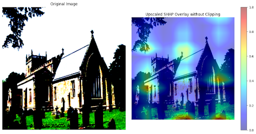
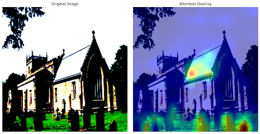
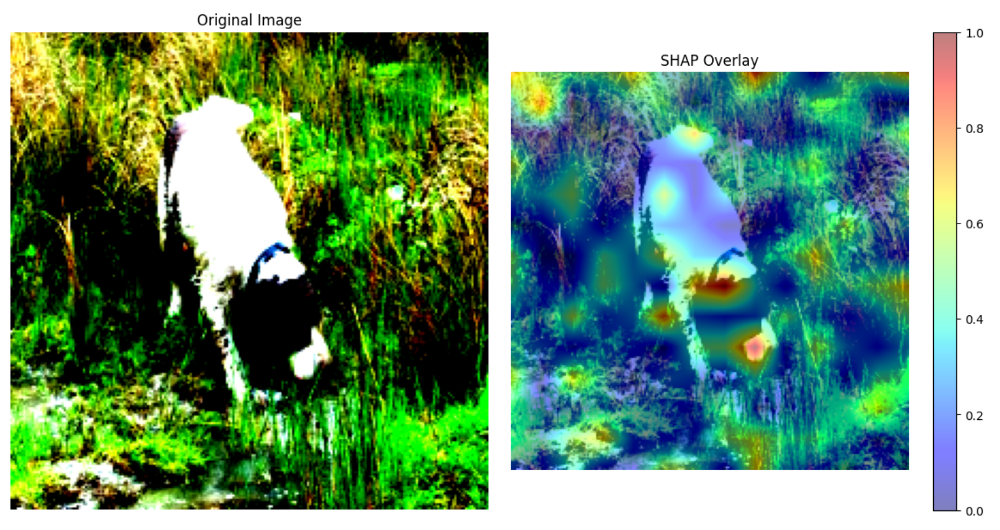
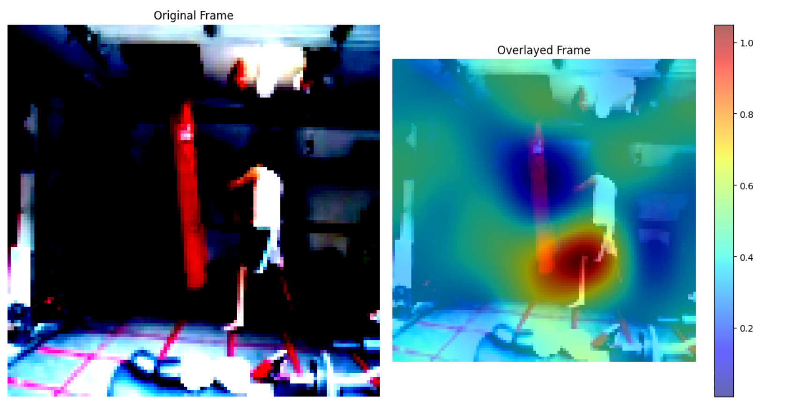

# LearnedSHAP: a brief case study on self-proposed LearnedSHAP vs. GradientSHAP.

Performed as evaluation to join UW Computer Vision Lab under Prof. Vikas Singh. See [here](https://docs.google.com/presentation/d/1Mb2gKSIBKJRPd86N4UGMgf7CR3XMUyZR-rViMY2amHU/edit?usp=sharing) for a brief slideshow detailing findings, with more images. Otherwise, continue reading.

## Setup

1. `pip install -r requirements.txt`
2. `make build`
3. `make run`

## Repo Structure

`/gradient_shap` → Gradient SHAP experiments, see `gradient_shap.ipynb`.

`/learned_shap` → Learned SHAP experiments, see `learned_shap.ipynb`.

`/data` → builds dataloaders and stores datasets

`/models` → holds model files (`harsanyi.py`, `resnet_3d.py`, `vit.py`, etc.)

note: opted for GradientExplainer rather than DeepSHAP due to lack of GELU/LayerNorm/Identity compatibility

## Introduction

Shapley values are frequently calculated and utilized in order to determine which features contribute most to a model output. Current practices involve methodologies such as GradientSHAP, DeepSHAP, etc.

However, with the proposal of [HarsanyiNet](https://arxiv.org/abs/2304.01811), this project aims to replicate it's results using a more novel methodology; namely, by simply treating Shapley values as learnable parameters whilst training the model. Whilst this lightly dilutes the performance of the model itself, LearnedSHAP is able to accurately highlight regions with high contribution scores.

To add an additional understanding of global context, LearnedSHAP additionally implements **pairwise relationships** between patches, inspired by ViTs and their inherent patching mechanisms.

## Objective

Goal: perform a case-study on Shapley Value collection methodologies on ViTs and 3d-ResNets.
1. Reproduce observable differences between Gradient SHAP and Learned SHAP
2. Evaluate methodologies based on accuracy and interpretability
3. Discuss limitations and potential improvements

## LearnedSHAP vs GradientSHAP

### LearnedSHAP

1. Lightly inspired by [HarsanyiNet](https://arxiv.org/abs/2304.01811)
2. Learnable params assign contribution weights to each patch and each pair of patches
3. Computes contributions via weighted sum of transformer outputs & weights
4. Estimates shapley values by summing individual and pairwise contributions

### GradientSHAP

1. Perturbs baseline images
2. Calculates the gradient of the model’s output w.r.t. each perturbed input, relative to the original input
3. Estimates contributions by averaging gradients over multiple perturbed inputs

## Expected Result

### LearnedSHAP

1. Stronger global context, potentially highlighting sections that are only relevant in relation to another region
2. More distributed regions of interest, covering patches that are jointly influential

### GradientSHAP

1. clearer localization of individual features - sharper, more defined highlighted regions
2. focusing on local details rather than coherent global structures

## Key Findings

1. ViTs global contextual perspective is clearly more prominent in LearnedSHAP compared to GradientSHAP, due to the pairwise relationships captured by LearnedSHAP
2. While GradientSHAP is able to effectively highlight ROIs, LearnedSHAP includes an additional layer of global context for a similar reason as (1), with pairwise relationships reflecting well-known weaknesses in models such as ResNets by highlighting extraneous regions of movement (i.e. lighting changes), proving a strong correlation between the models output and visual noise.

## Example SHAP Overlays (see [slides](https://docs.google.com/presentation/d/1Mb2gKSIBKJRPd86N4UGMgf7CR3XMUyZR-rViMY2amHU/edit?usp=sharing) or notebooks for detailed explanations, and a complete collection of images)

### GradientSHAP (ViT) vs Attention Map

**GradientSHAP:**

**Attention:**

### LearnedSHAP

**ViT:**

**3D-ResNet:**

